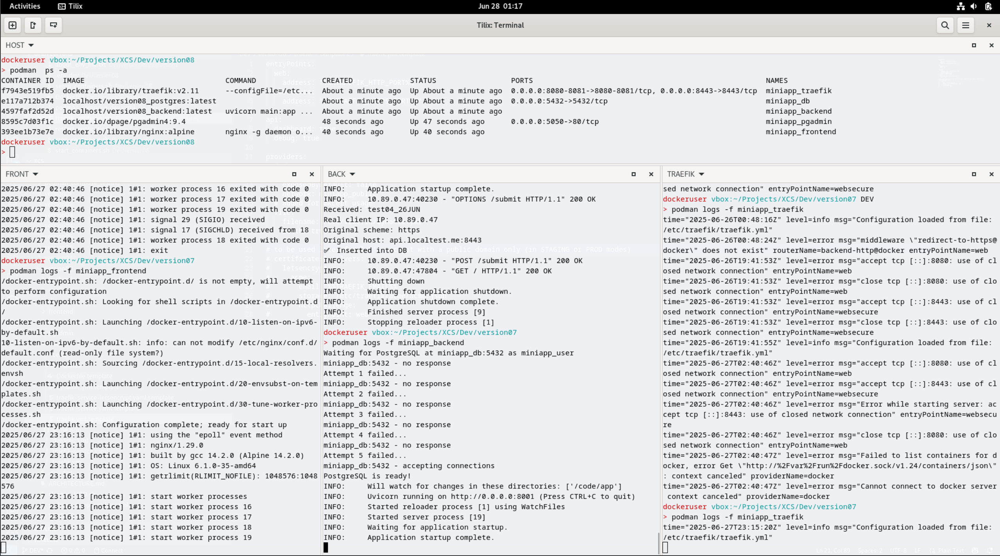
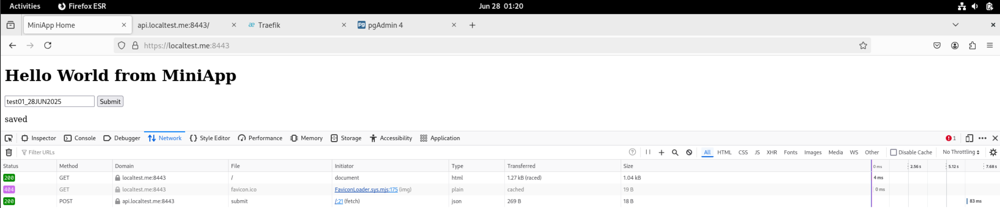
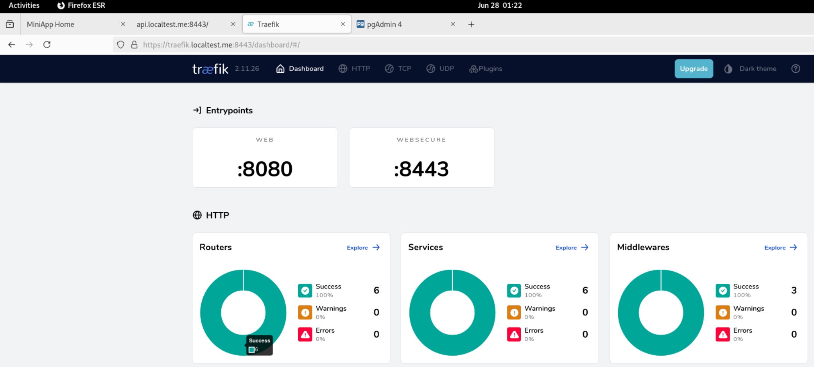
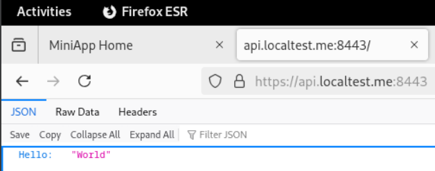
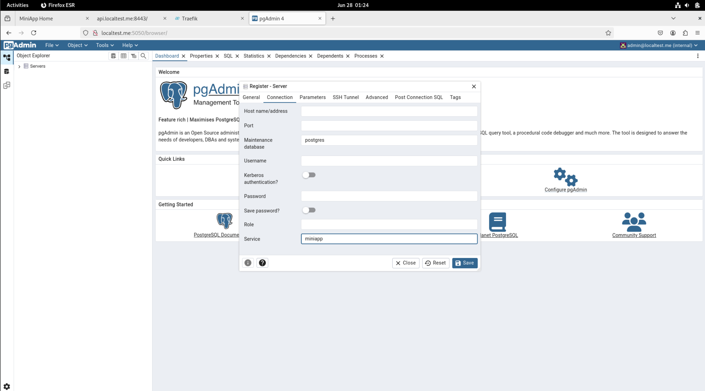

# Podman v4, Traefik v2, Postgres - Fullstack Baseline

## 🎯 Purpose

Deploy a simple **rootless Podman** stack with containers, services, and networks on localhost. This repository provides a working example of container orchestration with Podman, filling the gap where most examples use Docker.

> **⚠️ DEVELOPMENT ONLY**  
> This setup is **strictly for local development and learning**. Never use this configuration for staging or production environments, and never deploy on VPS or remote servers.

## 📋 Description

Complete localhost stack with TLS encryption, HTTP→HTTPS redirection, and load balancing:

- **Frontend**: nginx:alpine serving static content
- **Backend**: Python 3.11 FastAPI application  
- **Database**: PostgreSQL with initialization scripts
- **Reverse Proxy**: Traefik v2.11 with SSL termination
- **Admin Tools**: pgAdmin for database management

## 🛠️ Prerequisites

### System Requirements
- **OS**: Debian 12 (arm64) 40Gb HD, 4 CPU, 8Gb RAM- tested platform
- **User**: Non-root user dedicated to Podman (referenced as `dockeruser`)
- **Architecture**: Should work on Ubuntu 24+ but not tested

### Required Software
- **Podman**: 4.3.1+
- **podman-compose**: 1.4.0+
- **mkcert**: For local SSL certificates

### Optional Tools
- **Visual Studio Code** (IDE)
- **Tilix** (terminal emulator for multiple panes - recommended for log monitoring)
- **podman-desktop** (via flatpak)
- **ipcalc, tree** (utilities)

## 🚀 Setup Instructions

### 1. System Preparation
```bash
# Create dedicated user for Podman
sudo adduser dockeruser
sudo usermod -aG sudo dockeruser
su - dockeruser

# Create project directory
mkdir ~/myapp
cd ~/myapp
```
note: pls check setup_containers.sh which may required a directory pattern like "versionxx" as dirname.

### 2. Repository Setup
```bash
# Initialize local Git repository
git init

# Clone this repository
git clone https://github.com/HornetGit/PODMAN_V4.x_DEV_STACK.git .

# Verify directory structure
tree .
# Compare with included tree.txt reference
```

### 3. SSL Certificate Setup
```bash
# Generate and install SSL certificates automatically
./setup_certificates.sh

# This script will:
# - Install mkcert CA in local trust store (mkcert -install)
# - Generate certificates for localtest.me domains
# - Configure Traefik to use the certificates
```

### 4. Launch Application
```bash
# Start all services
./restart_application.sh

# Optional: Monitor logs in separate terminals
# Recommended: Use Tilix with multiple panes for live monitoring
```

### 5. Access Services

| Service | URL | Description |
|---------|-----|-------------|
| **Frontend** | https://localtest.me:8443/ | Main application |
| **Backend API** | https://api.localtest.me:8443/ | REST API endpoints |
| **Traefik Dashboard** | https://traefik.localtest.me:8443/dashboard/ | Proxy configuration |
| **pgAdmin** | http://localhost:5050 | Database administration |
Note: sudo nano /etc/hosts might be required to set the local DNS capability (adding '127.0.0.1 localtest.me api.localtest.me traefik.localtest.me').

### 6. Test the Application
1. Open https://localtest.me:8443/
2. Enter text in the form and submit
3. Verify data appears as "saved" (stored in PostgreSQL)
4. Check pgAdmin to see stored data

## 📸 Screenshots

### Live Log Monitoring with Tilix

*Tilix terminal showing live logs from Frontend, Backend, and Traefik services*

### Application Screenshots

*Main application interface at https://localtest.me:8443/*


*Traefik proxy dashboard showing all configured routes*


*Backend API responding to frontend requests*


*Remove port and admin and Apply for the "miniapp" defined pgadmin service*


*Recorded*


## 🔧 Configuration Files

### Key Files
- `podman-compose-dev.yaml` - Main service definitions
- `.env.dev` - Environment variables (safe demo values)
- `traefik/` - Reverse proxy configuration
- `frontend/` - Static web content
- `backend/` - Python FastAPI application
- `db/` - PostgreSQL initialization

### Important Notes
- All passwords are demo values - **change for any real use**
- Self-signed certificates work only for `localtest.me` domains
- Networks are isolated (public/private topology)

## 🏗️ Architecture

```
Browser → Traefik:8443 (HTTPS) → Services
                ↓
    ┌─────────────────────────────┐
    │         Traefik             │
    │    (SSL Termination)        │
    └─────────────────────────────┘
                ↓
    ┌──────────┬─────────────────┐
    │ Frontend │    Backend      │
    │ (nginx)  │   (FastAPI)     │
    └──────────┴─────────────────┘
                ↓
    ┌─────────────────────────────┐
    │        PostgreSQL           │
    │     (Private Network)       │
    └─────────────────────────────┘
```

## 🚧 Troubleshooting

### Common Issues
1. **Certificate warnings**: Run `mkcert -install` first
2. **Port conflicts**: Ensure ports 8080, 8443, 5050 are available
3. **Permission denied**: Verify user is in podman group
4. **Service not starting**: Check `podman logs <container-name>`

### Logs and Debugging
```bash
# View all service logs
podman-compose logs

# Individual service logs
podman logs miniapp_traefik
podman logs miniapp_backend
podman logs miniapp_frontend

# Live monitoring (recommended setup with Tilix)
# Terminal 1: Frontend logs
podman logs -f miniapp_frontend

# Terminal 2: Backend logs  
podman logs -f miniapp_backend

# Terminal 3: Traefik logs
podman logs -f miniapp_traefik
```

## 📚 Learning Opportunities

### Next Steps
- **Security**: Add input validation and rate limiting
- **Monitoring**: Implement Prometheus metrics
- **Testing**: Add automated tests with different tools
- **Certificates**: Implement per-service SSL certificates
- **Authentication**: Add OAuth2/JWT authentication
- **Observability**: Enable Traefik tracing and metrics
- **Optimization**: Remove provider redundancies
- **Upgrade**: Test with Podman 5.x and healthchecks
- **Orchestration**: Convert to Kubernetes manifests
- **Modularity**: Split into independent microservices
- **Staging**: Automate Let's Encrypt for staging environments

### Educational Value
This baseline provides hands-on experience with:
- Container orchestration without Docker
- Reverse proxy configuration
- SSL/TLS in development
- Database integration
- API development patterns
- Network isolation strategies

## 🎉 Happy Learning and Coding!

---

> **Feedback Welcome**: This repository aims to fill a gap in Podman examples. Issues and improvements are encouraged!

---

## 📝 License

This project is licensed under the MIT License - see the [LICENSE](LICENSE) file for details.

## 👨‍💻 Author

**[XCS HornetGit]**
- GitHub: [@HornetGit](https://github.com/HornetGit)
- Email: hornet.foobar@gmail.com

## 🤝 Contributing

Contributions, issues, and feature requests are welcome!
- 🐛 **Found a bug?** [Open an issue](https://github.com/HornetGit/PODMAN_DEV_STACK/issues)
- 💡 **Have an idea?** [Start a discussion](https://github.com/HornetGit/PODMAN_DEV_STACK/discussions)
- 🔧 **Want to contribute?** Fork the repo and submit a pull request

> **Feedback Welcome**: This repository aims to fill a gap in Podman examples. Issues and improvements are encouraged!